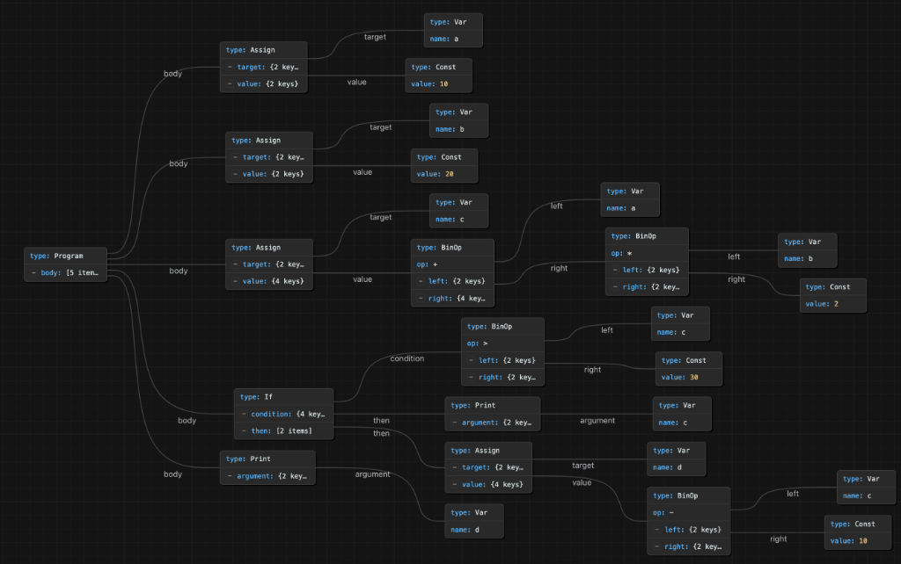
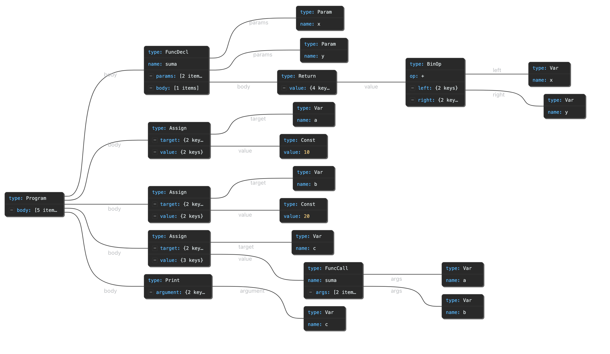

# Minicompi
Universidad Rafael Landivar
Carlos Hugo Escobar Gómez | 1563824
Compiladores


## Programa de entrada

```
inicio
    a = 10
    b = 20
    c = a + b * 2
    si (c > 30) entonces
        escribir(c)
        d = c - 10
    finsi
    escribir(d)
fin
```

---

## 1. Análisis léxico

### Definición de tokens

| Categoría               | Token                    |
| ----------------------- | ------------------------ |
| Palabras reservadas     | `inicio`                 |
|                         | `fin`                    |
|                         | `si`                     |
|                         | `entonces`               |
|                         | `finsi`                  |
|                         | `escribir`               |
| Operadores aritméticos  | `+`                      |
|                         | `-`                      |
|                         | `*`                      |
|                         | `/`                      |
| Operadores relacionales | `>`                      |
|                         | `<`                      |
|                         | ==                       |
| Asignación              | `=`                      |
| Delimitadores           | `(`                      |
|                         | `)`                      |
| Literales / símbolos    | letra (letra \| dígito)* |
|                         | dígito+                  |
|                         |                          |

### Secuencia de tokens

| Línea | Código                 | Tokens generados                                                      |
| ----- | ---------------------- | --------------------------------------------------------------------- |
| 1     | `inicio`               | `INICIO`                                                              |
| 2     | `a = 10`               | `ID("a")`, `ASIGN`, `NUM(10)`                                         |
| 3     | `b = 20`               | `ID("b")`, `ASIGN`, `NUM(20)`                                         |
| 4     | `c = a + b * 2`        | `ID("c")`, `ASIGN`, `ID("a")`, `MAS`, `ID("b")`, `MULT`, `NUM(2)`     |
| 5     | `si (c > 30) entonces` | `SI`, `PAR_IZQ`, `ID("c")`, `MAYOR`, `NUM(30)`, `PAR_DER`, `ENTONCES` |
| 6     | `escribir(c)`          | `ESCRIBIR`, `PAR_IZQ`, `ID("c")`, `PAR_DER`                           |
| 7     | `d = c - 10`           | `ID("d")`, `ASIGN`, `ID("c")`, `MENOS`, `NUM(10)`                     |
| 8     | `finsi`                | `FINSI`                                                               |
| 9     | `escribir(d)`          | `ESCRIBIR`, `PAR_IZQ`, `ID("d")`, `PAR_DER`                           |
| 10    | `fin`                  | `FIN`                                                                 |

---

## 2. Análisis sintáctico (AST)

### Nodos del AST

- **Program**: raíz del árbol, contiene la lista de sentencias.
- **Assign**: asignación (`variable = expresión`).
- **BinOp**: operación binaria (`izq op der`).
- **Const**: constante numérica.
- **Var**: referencia a variable.
- **If**: condicional (`condición`, `cuerpo`).
- **Print**: sentencia `escribir(expr)`.

## 3. Json

```json
{
  "type": "Program",
  "body": [
    {
      "type": "Assign",
      "target": { "type": "Var", "name": "a" },
      "value":  { "type": "Const", "value": 10 }
    },
    {
      "type": "Assign",
      "target": { "type": "Var", "name": "b" },
      "value":  { "type": "Const", "value": 20 }
    },
    {
      "type": "Assign",
      "target": { "type": "Var", "name": "c" },
      "value": {
        "type": "BinOp",
        "op": "+",
        "left":  { "type": "Var", "name": "a" },
        "right": {
          "type": "BinOp",
          "op": "*",
          "left":  { "type": "Var", "name": "b" },
          "right": { "type": "Const", "value": 2 }
        }
      }
    },
    {
      "type": "If",
      "condition": {
        "type": "BinOp",
        "op": ">",
        "left":  { "type": "Var", "name": "c" },
        "right": { "type": "Const", "value": 30 }
      },
      "then": [
        {
          "type": "Print",
          "argument": { "type": "Var", "name": "c" }
        },
        {
          "type": "Assign",
          "target": { "type": "Var", "name": "d" },
          "value": {
            "type": "BinOp",
            "op": "-",
            "left":  { "type": "Var", "name": "c" },
            "right": { "type": "Const", "value": 10 }
          }
        }
      ]
    },
    {
      "type": "Print",
      "argument": { "type": "Var", "name": "d" }
    }
  ]
}
```



---

## 3. Análisis semántico

### Tabla de símbolos tras la ejecución

`c = 10 + 20*2 = 50`;  `50 > 30` es verdadero, se ejecuta el  `si` y `d = 50 - 10 = 40`.

| Nombre | Tipo  | Ámbito | Valor final |
| ------ | ----- | ------ | ----------- |
| `a`    | `int` | global | 10          |
| `b`    | `int` | global | 20          |
| `c`    | `int` | global | 50          |
| `d`    | `int` | global | 40          |

### ¿Hay error semántico?

No hay errores, todas las operaciones son entre enteros y la condición produce un booleano válido para el `si`.

**Uso de `d`:** el bloque `si ... finsi` no crea un nuevo ámbito léxico, todas las variables viven en un único ámbito global del programa. Por eso `d` es visible tras el `finsi` y el `escribir(d)` se considera sintácticamente válido pero si la condición `c > 30` fuera falsa, `d` nunca se asignaría y `escribir(d)` leería un valor indefinido. En esta ejecución concreta no ocurre porque `c = 50`, pero debería emitir una **advertencia de inicialización condicional** mediante análisis de flujo.

---

## 4. Optimización de código de 3 direcciones

```
t1 = b * 2
t2 = a + t1
c  = t2
t3 = c > 30
if_false t3 goto L2
    escribir c
    t4 = c - 10
    d  = t4
L2:
escribir d
```

### Optimización 1

`a` y `b` son asignadas constantes que no se modifican antes de usarse. Se propagan sus valores y luego se pliegan las expresiones constantes en tiempo de compilación:

- `b * 2` → `20 * 2` → `40`
- `a + 40` → `10 + 40` → `50`
- `c > 30` → `50 > 30` → `true`
- `c - 10` → `50 - 10` → `40`

### Optimización 2

Como la condición se pliega a `true`, el salto condicional nunca se toma. El test `if_false` y la etiqueta `L2` dejan de tener utilidad y pueden eliminarse. Los temporales `t1, t2, t3, t4` ya no son necesarios porque sus valores fueron plegados, solo me hacen estorbo.

### Código de 3 direcciones optimizado

```
a = 10
b = 20
c = 50
escribir c
d = 40
escribir d
```

Ahora a y b estan solo ahi sin hacer nada con su vida, entonces son variables muertas.

```
c = 50
escribir c
d = 40
escribir d
```

---

## 5. Ensamblador


```asm
.data
    newline: .asciiz "\n"

.text
.globl main
main:
    # --- a = 10 ---
    li   $t0, 10            # $t0 = a

    # --- b = 20 ---
    li   $t1, 20            # $t1 = b

    # --- c = a + b * 2 ---
    sll  $t4, $t1, 1        # $t4 = b * 2  (usando shift como reduccion de fuerza)
    add  $t2, $t0, $t4      # $t2 = a + (b*2)   => c

    # --- si (c > 30) entonces ---
    li   $t5, 30
    ble  $t2, $t5, FIN_SI   # si c <= 30, saltar al final del si

        # escribir(c)
        li   $v0, 1
        move $a0, $t2
        syscall
        li   $v0, 4
        la   $a0, newline
        syscall

        # d = c - 10
        addi $t3, $t2, -10   # $t3 = d

FIN_SI:
    # --- escribir(d) ---
    li   $v0, 1
    move $a0, $t3
    syscall
    li   $v0, 4
    la   $a0, newline
    syscall

    # --- fin ---
    li   $v0, 10
    syscall
```

---

## 6. Solo para que mire que si puedo `suma(x, y)`

### Programa 

```
inicio
    a = 10
    b = 20
    c = suma(a, b)
    escribir(c)
fin

funcion suma(x, y)
    retornar x + y
finfuncion
```

### Cambios en el AST

Se introducen tres nodos nuevos:

- **FuncDecl**: declaración de función (`nombre`, `parámetros`, `cuerpo`).
- **FuncCall**: llamada a función (`nombre`, `argumentos`).
- **Return**: sentencia de retorno (`expresión`).

```json
{
  "type": "Program",
  "body": [
    {
      "type": "FuncDecl",
      "name": "suma",
      "params": [
        { "type": "Param", "name": "x" },
        { "type": "Param", "name": "y" }
      ],
      "body": [
        {
          "type": "Return",
          "value": {
            "type": "BinOp",
            "op": "+",
            "left":  { "type": "Var", "name": "x" },
            "right": { "type": "Var", "name": "y" }
          }
        }
      ]
    },
    {
      "type": "Assign",
      "target": { "type": "Var", "name": "a" },
      "value":  { "type": "Const", "value": 10 }
    },
    {
      "type": "Assign",
      "target": { "type": "Var", "name": "b" },
      "value":  { "type": "Const", "value": 20 }
    },
    {
      "type": "Assign",
      "target": { "type": "Var", "name": "c" },
      "value": {
        "type": "FuncCall",
        "name": "suma",
        "args": [
          { "type": "Var", "name": "a" },
          { "type": "Var", "name": "b" }
        ]
      }
    },
    {
      "type": "Print",
      "argument": { "type": "Var", "name": "c" }
    }
  ]
}
```


### Nueva tabla de símbolos 

**Ámbito global**

|Nombre|Categoría|Tipo|Firma / valor|
|---|---|---|---|
|`suma`|función|`int (int, int)`|params: `x, y`|
|`a`|variable|`int`|10|
|`b`|variable|`int`|20|
|`c`|variable|`int`|30|

**Ámbito local de `suma`**

|Nombre|Categoría|Tipo|Posición|
|---|---|---|---|
|`x`|parámetro|`int`|arg 0 (`$a0`)|
|`y`|parámetro|`int`|arg 1 (`$a1`)|

La resolución de nombres se hace primero en el ámbito local y, si no se encuentra, en el global (regla de búsqueda léxica estándar).

### Código ensamblador con `jal` y `jr`

```mips
.data
    newline: .asciiz "\n"

.text
.globl main
main:
    # --- a = 10 ---
    li   $t0, 10

    # --- b = 20 ---
    li   $t1, 20

    # --- c = suma(a, b) ---
    move $a0, $t0           # primer argumento  (x = a)
    move $a1, $t1           # segundo argumento (y = b)
    jal  suma               # salto con enlace; $ra = dir. retorno
    move $t2, $v0           # c = valor retornado en $v0

    # --- escribir(c) ---
    li   $v0, 1
    move $a0, $t2
    syscall
    li   $v0, 4
    la   $a0, newline
    syscall

    # --- fin ---
    li   $v0, 10
    syscall

# -------------------------------------------------
# funcion suma(x, y): retornar x + y
#   convenciones:
#     $a0 = x, $a1 = y
#     $v0 = valor de retorno
#     $ra = direccion de retorno (guardada por jal)
# -------------------------------------------------
suma:
    add  $v0, $a0, $a1      # v0 = x + y
    jr   $ra                # retorno al llamador
```
